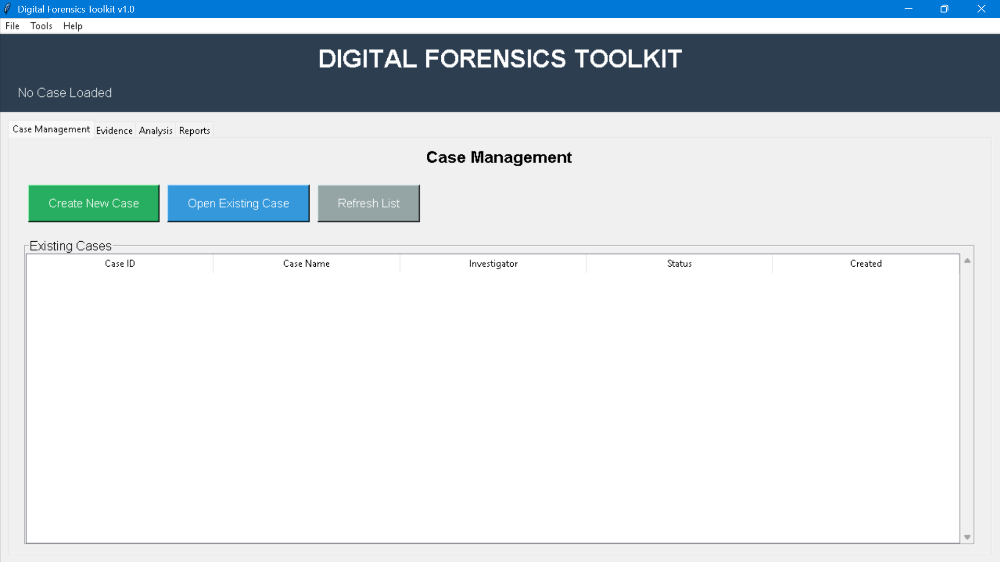
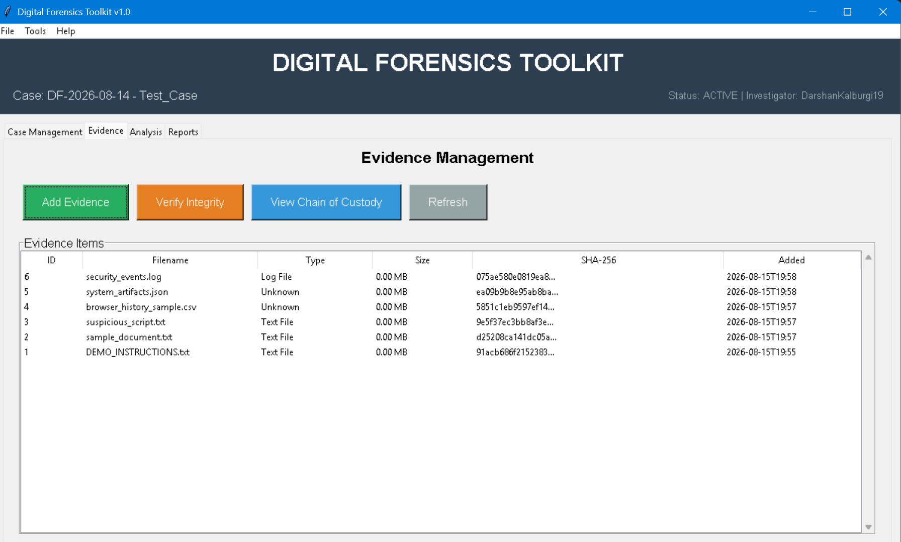
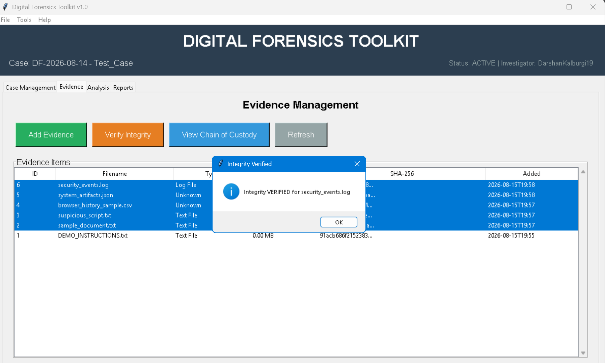
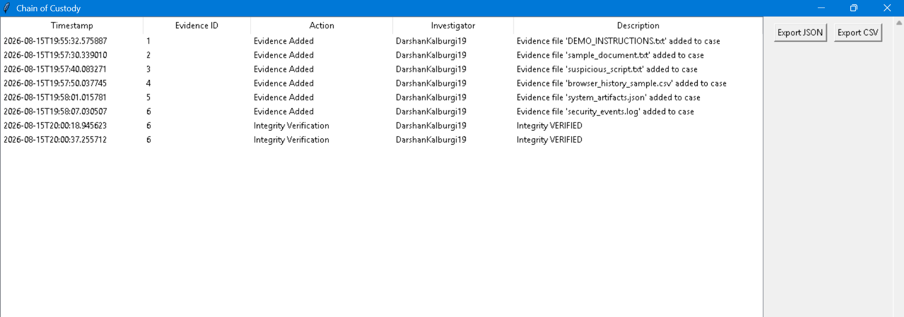
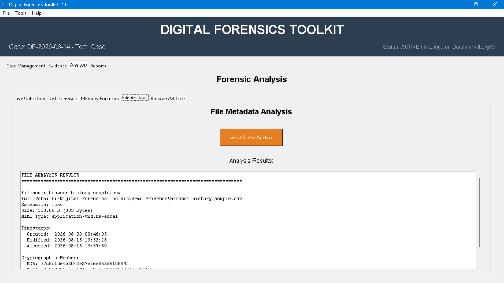
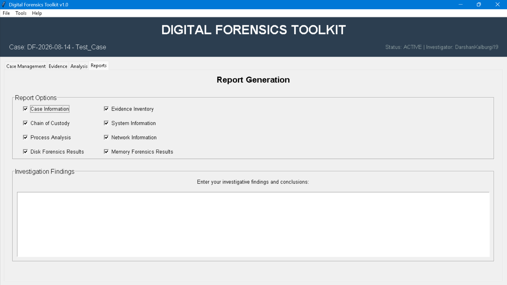

# Digital Forensics Toolkit


A modular, educational **Digital Forensics Toolkit** built in Python for demonstrating common forensic investigation workflows: case management, evidence handling, cryptographic integrity verification, chain-of-custody tracking, live system collection, file/artifact analysis, external forensic-tool integration, and PDF report generation.

> **Project status:** Internship project / educational demonstration  
> **Primary focus:** Digital forensics, evidence integrity, investigation workflow, and cybersecurity tooling

---

## Overview

Digital forensic investigations require evidence to be handled consistently, documented carefully, and analyzed without losing track of its integrity.

This project provides a single desktop interface for demonstrating that workflow:

```text
Create Case
    ↓
Add Evidence
    ↓
Calculate Cryptographic Hashes
    ↓
Verify Evidence Integrity
    ↓
Maintain Chain of Custody
    ↓
Collect / Analyze Artifacts
    ↓
Record Findings
    ↓
Generate Investigation Report
```

The toolkit is intentionally designed as an **educational forensic workflow platform**, not as a replacement for certified commercial forensic suites.

---

## Key Features

### Case Management

- Create and manage forensic investigation cases
- Store case metadata and investigator information
- Track case status and timeline
- Maintain case-specific working directories
- Organize evidence and investigation records

### Evidence Management

- Add evidence files to an investigation
- Maintain an evidence inventory
- Record file metadata
- Calculate multiple cryptographic hashes
- Verify evidence integrity against previously recorded hashes
- Track evidence-related actions through the chain of custody

### Cryptographic Hashing

The toolkit supports:

- MD5
- SHA-1
- SHA-256
- SHA-512

SHA-256 is particularly useful as a modern integrity reference, while the additional algorithms are retained for compatibility and demonstration purposes.

Example workflow:

```text
Evidence File
     ↓
Read File
     ↓
Calculate Hashes
     ↓
Store Hash Values
     ↓
Later Verification
     ↓
MATCH / MISMATCH
```

### Chain of Custody

The toolkit records evidence-handling events such as:

- Evidence addition
- Hash calculation
- Integrity verification
- Analysis activity
- Other evidence-management actions

The chain-of-custody data can be exported for documentation.

> The implementation is intended to demonstrate the concept and workflow of chain-of-custody tracking. It should not be interpreted as a legally certified evidence-management system.

### Live System Collection

The toolkit can collect information from the currently running system, including:

- Operating-system information
- Host/system information
- CPU and memory information
- Network interfaces
- Running processes
- Network connections

Live collection is explicitly different from forensic acquisition of a powered-off system or storage image.

### File Analysis

The file-analysis module can inspect:

- Filename
- Absolute path
- File size
- Extension
- File type
- File signature / magic bytes
- File category
- MD5
- SHA-1
- SHA-256
- SHA-512
- Created / modified / accessed timestamps

The project uses an optional `python-magic` capability when available and falls back to Python's MIME-type detection when it is not.

### Browser Artifact Collection

The browser-artifact collector is designed to demonstrate extraction of browsing-history metadata from supported browser profiles.

It can work with:

- Chrome
- Edge
- Firefox

The browser module focuses on history metadata and **does not extract browser passwords or credentials**.

### Disk Forensics

The project includes a Sleuth Kit integration layer for common disk-forensics commands such as:

- `mmls` — partition layout
- `fsstat` — filesystem information
- `fls` — file and directory listing
- `istat` — inode metadata

These integrations allow the toolkit to act as a workflow layer around command-line forensic utilities.

### Memory Forensics

The project includes an integration layer for Volatility 3 and supports workflows around plugins such as:

- `windows.info`
- `windows.pslist`
- `windows.pstree`
- `windows.netstat`
- `windows.cmdline`
- `windows.dlllist`

Volatility 3 is treated as an external forensic analysis dependency rather than a bundled component.

### Autopsy and FTK Imager Guidance

The project also provides workflow guidance for:

- Autopsy
- FTK Imager

These are **workflow/documentation integrations**, not direct programmatic integrations.

This distinction is intentional so that the project does not overstate its capabilities.

### PDF Report Generation

The report generator creates structured PDF investigation reports containing sections such as:

- Case information
- Evidence inventory
- Chain of custody
- System information
- Process information
- Analysis results
- Investigator findings

Reports are generated using ReportLab.

---

## Architecture

```text
                    ┌──────────────────────────┐
                    │      Tkinter GUI         │
                    │   Desktop Application    │
                    └────────────┬─────────────┘
                                 │
          ┌──────────────────────┼──────────────────────┐
          │                      │                      │
          ▼                      ▼                      ▼
   Case Management        Evidence Management       Analysis
          │                      │                      │
          │                      ├── Hashing            ├── File Analysis
          │                      ├── Integrity          ├── Browser Artifacts
          │                      └── Chain of Custody   ├── Disk Analysis
          │                                             └── Memory Analysis
          │
          └──────────────────────┬──────────────────────┘
                                 │
                                 ▼
                       Live System Collectors
                                 │
                    ┌────────────┼────────────┐
                    ▼            ▼            ▼
                 System       Process      Network
                 Info         Info         Connections
                                 │
                                 ▼
                       External Tool Layer
                         │             │
                         ▼             ▼
                    Sleuth Kit     Volatility 3
                         │
                    Workflow Guides
                         │
                  ┌──────┴──────┐
                  ▼             ▼
               Autopsy      FTK Imager

                                 │
                                 ▼
                         Report Generator
                                 │
                                 ▼
                            PDF Report
```

---

## Project Structure

```text
Digital-Forensics-Toolkit/
│
├── analyzers/
│   ├── disk_analyzer.py
│   ├── file_analyzer.py
│   ├── memory_analyzer.py
│   └── __init__.py
│
├── collectors/
│   ├── browser_artifacts.py
│   ├── file_metadata.py
│   ├── network_collector.py
│   ├── process_collector.py
│   ├── system_collector.py
│   └── __init__.py
│
├── config/
│   └── config.json
│
├── core/
│   ├── case_manager.py
│   ├── chain_of_custody.py
│   ├── evidence_manager.py
│   ├── hashing.py
│   ├── logger.py
│   └── __init__.py
│
├── gui/
│   ├── analysis_tab.py
│   ├── case_tab.py
│   ├── evidence_tab.py
│   ├── main_window.py
│   ├── report_tab.py
│   └── __init__.py
│
├── integrations/
│   ├── autopsy.py
│   ├── ftk_imager.py
│   ├── sleuthkit.py
│   ├── volatility.py
│   └── __init__.py
│
├── reports/
│   ├── report_generator.py
│   └── __init__.py
│
├── demo_evidence/
│   ├── sample_document.txt
│   ├── suspicious_script.txt
│   ├── browser_history_sample.csv
│   ├── system_artifacts.json
│   ├── security_events.log
│   └── README.txt
│
├── tests/
│   ├── test_case_manager.py
│   ├── test_chain_of_custody.py
│   ├── test_hashing.py
│   └── __init__.py
│
├── app.py
├── generate_demo_case.py
├── DEMO_INSTRUCTIONS.txt
├── requirements.txt
├── .gitignore
├── LICENSE
└── README.md
```

---

## Technology Stack

| Component | Technology |
|---|---|
| Language | Python 3.12+ |
| GUI | Tkinter |
| System information | psutil |
| PDF reporting | ReportLab |
| Database / persistence | SQLite |
| File hashing | Python `hashlib` |
| Disk forensics | Sleuth Kit |
| Memory forensics | Volatility 3 |
| Browser artifacts | SQLite-based browser history analysis |
| Optional file identification | python-magic |
| Testing | Python `unittest` |

---

## Requirements

### Core Requirements

- Python 3.12 or newer
- Tkinter
- `psutil`
- `reportlab`

The core Python dependencies are listed in:

```text
requirements.txt
```

### Optional Dependencies / External Tools

Depending on the functionality being used, you may additionally install:

- `python-magic` for enhanced file-type identification
- Sleuth Kit for disk-image analysis
- Volatility 3 for memory-dump analysis
- Autopsy for GUI-based forensic workflows
- FTK Imager for evidence acquisition

External tools are intentionally kept separate from the core Python installation.

---

## Installation

### 1. Clone the Repository

```bash
git clone https://github.com/DarshanKalburgi19/Digital_Forensics_Toolkit.git
cd Digital_Forensics_Toolkit
```

Replace `DarshanKalburgi19` with your GitHub username.

### 2. Create a Virtual Environment

Windows:

```powershell
python -m venv venv
venv\Scripts\activate
```

Linux / macOS:

```bash
python3 -m venv venv
source venv/bin/activate
```

### 3. Install Python Dependencies

```bash
python -m pip install --upgrade pip
pip install -r requirements.txt
```

### 4. Optional: Enhanced File-Type Detection

If desired:

```bash
pip install python-magic
```

On some operating systems, `python-magic` may also require the system's `libmagic` package.

### 5. Verify the Installation

```bash
python -c "import psutil; import reportlab; print('Dependencies OK')"
```

---

## Running the Application

Launch the desktop application with:

```bash
python app.py
```

The toolkit opens as a Tkinter-based desktop interface.

---

## Demo Workflow

The repository contains synthetic evidence specifically for safe demonstration.

### Generate Demo Evidence

```bash
python generate_demo_case.py
```

This creates demonstration artifacts inside:

```text
demo_evidence/
```

### Demo Evidence Includes

```text
sample_document.txt
suspicious_script.txt
browser_history_sample.csv
system_artifacts.json
security_events.log
```

All of these files are synthetic.

The `suspicious_script.txt` file is intentionally harmless and does not contain real malware.

### Recommended Investigation Workflow

1. Launch the application.
2. Create a new case.
3. Add the files from `demo_evidence/`.
4. Review the evidence inventory.
5. Calculate and record hashes.
6. Verify evidence integrity.
7. Open the chain-of-custody view.
8. Perform file analysis.
9. Perform live system/process/network collection if appropriate.
10. Review the collected artifacts.
11. Record investigator findings.
12. Generate the final PDF report.

Detailed instructions are also available in:

```text
DEMO_INSTRUCTIONS.txt
```

---

## Example Forensic Workflow

A typical demonstration can follow this sequence:

```text
                    CASE CREATION
                         │
                         ▼
                  EVIDENCE IMPORT
                         │
                         ▼
                 HASH CALCULATION
                         │
                         ▼
                EVIDENCE INVENTORY
                         │
                         ▼
               INTEGRITY VERIFICATION
                         │
                         ▼
                 CHAIN OF CUSTODY
                         │
                         ▼
              ARTIFACT / FILE ANALYSIS
                         │
                         ▼
               INVESTIGATOR FINDINGS
                         │
                         ▼
                  PDF REPORT
```

---

## Screenshots

Added project screenshots to:

```text
screenshots/
```

screenshots:

```text
01-dashboard.png
02-case-creation.png
03-evidence-inventory.png
04-hash-verification.png
05-chain-of-custody.png
06-file-analysis.png
07-system-collection.png
08-forensic-report.png
```

Example:

### Dashboard



### Evidence Inventory



### Integrity Verification



### Chain of Custody



### File Analysis



### Generated Report



> If the screenshots are not included in a particular clone of the repository, the image references above will naturally appear as unavailable until the files are added.

---

## Testing

The project includes unit tests for important core functionality, including:

- Case management
- Hashing
- Chain-of-custody operations

Run the test suite with:

```bash
python -m unittest discover -v
```


---

## Code Quality / Submission Improvements

The version includes the following cleanup considerations:

### Safer psutil typing

The network collector should avoid relying on the private/internal:

```python
psutil._common.sconn
```

API.

A public/stable typing approach such as `Any` is preferred because internal psutil structures can change between versions.

### Optional `python-magic`

File analysis uses `python-magic` when available, but it should remain optional.

The file analyzer falls back to Python's standard MIME-type detection when `python-magic` is unavailable.

This keeps the core toolkit installable without requiring an operating-system-specific `libmagic` installation.

### Repository Hygiene

Generated/local files should not be committed to GitHub:

```text
__pycache__/
*.pyc
*.db
*.sqlite
logs/*.log
cases/*/
evidence/*
reports_output/*.pdf
```

Real forensic evidence must never be uploaded to a public repository.

---

## External Tool Integration

| Tool | Integration Type | Purpose |
|---|---|---|
| Sleuth Kit | Command-line integration | Disk and filesystem analysis |
| Volatility 3 | Command-line integration | Memory analysis |
| Autopsy | Workflow guidance | Full forensic case analysis |
| FTK Imager | Workflow guidance | Evidence acquisition / imaging |

### Sleuth Kit

The integration layer can be used to support workflows involving:

```text
mmls
fsstat
fls
istat
```

### Volatility 3

The integration layer supports workflows around selected Windows plugins:

```text
windows.info
windows.pslist
windows.pstree
windows.netstat
windows.cmdline
windows.dlllist
```

### Important distinction

Autopsy and FTK Imager are provided as workflow guidance in this project rather than being embedded as full programmatic integrations.

---

## Security and Legal Considerations

This project is intended for:

- Cybersecurity education
- Digital-forensics learning
- Lab environments
- Synthetic evidence analysis
- Authorized investigations

### Do not:

- Analyze systems without authorization.
- Upload real confidential evidence to a public GitHub repository.
- Execute suspicious files simply because they are part of an evidence set.
- Treat this educational toolkit as a legally certified forensic platform.
- Assume that generated reports automatically satisfy evidentiary requirements in court.

For real investigations, use appropriate forensic procedures, write-protection/acquisition controls, evidence handling procedures, organizational policies, and applicable legal requirements.

---

## Limitations

This project intentionally has limitations.

### 1. Educational rather than court-certified

The toolkit demonstrates forensic concepts but is not a certified forensic platform.

### 2. Live collection is not full forensic acquisition

Collecting system/process/network information from a running machine is different from acquiring a forensic disk image or memory image under controlled procedures.

### 3. External tools are separate dependencies

Sleuth Kit and Volatility 3 must be installed and configured separately.

### 4. Browser artifact support is limited

Browser collection focuses on history metadata and does not attempt to recover passwords or other protected credentials.

### 5. Chain of custody is application-level

The application records investigation events, but a real forensic process requires organizational and legal controls beyond software logging.

### 6. Cross-platform behavior may vary

Some system and external-tool features depend on the operating system and installed utilities.

---

## Future Improvements

Potential future enhancements include:

- SQLite-backed structured forensic case database improvements
- Evidence acquisition workflows with stronger write-protection support
- Memory-image acquisition integration
- Expanded Windows artifact parsing
- Registry artifact analysis
- Event log parsing
- Email artifact analysis
- Timeline generation
- YARA integration for controlled malware triage
- IOC extraction and correlation
- Advanced file-signature validation
- Automated anomaly detection
- Improved evidence export formats
- Role-based access control
- Stronger audit-log protection
- Automated report templates
- Additional unit and integration tests

---

## Learning Outcomes

This project demonstrates practical exposure to:

- Digital forensics fundamentals
- Evidence management
- Cryptographic hashing
- Integrity verification
- Chain-of-custody concepts
- File metadata analysis
- Browser artifact analysis
- Live system information collection
- Process and network inspection
- Disk-forensics tooling
- Memory-forensics tooling
- Python GUI development
- Modular software architecture
- Automated testing
- PDF report generation
- Cybersecurity documentation

---

## Internship Project Context

This project was developed as part of a cybersecurity internship project requirement.

The objective was to build and demonstrate a practical forensic toolkit covering evidence handling, investigation workflows, analysis, and reporting.

The repository is intended to provide a reproducible demonstration of the completed project and its implementation.

---

## License

This project is released under the MIT License.

See `LICENSE` for details.

---

## Author

**Darshan Kalburgi**

Cybersecurity / Information Technology Student

GitHub: `https://github.com/DarshanKalburgi19`

---

## Final Note

This toolkit is designed to demonstrate **how a digital-forensics investigation workflow can be organized in software**.

The key principle throughout the project is:

> **Preserve evidence integrity, document every important action, analyze systematically, and report findings clearly.**
